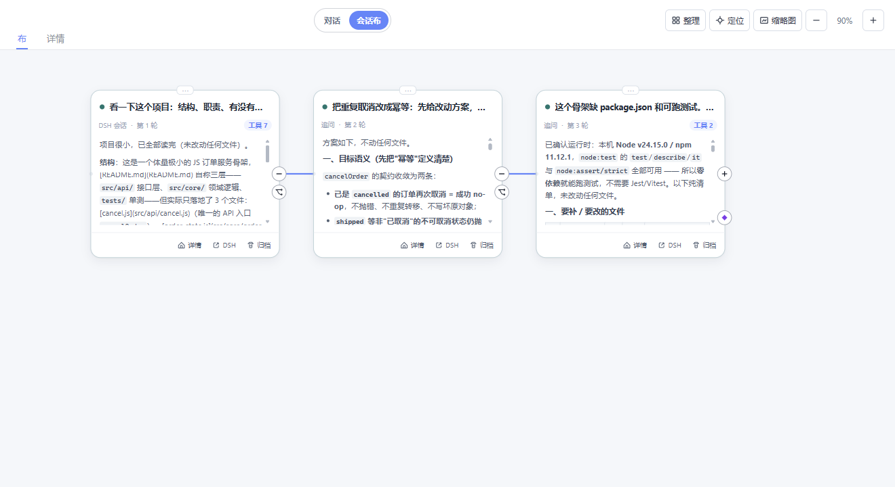

# @miasaki/dsh-canvas — 会话布

> DSH（DeepSeek Harness）的会话画布插件。把会话从「一条时间线」变成**一张可拖拽、可缩放的地图**：
> 每条追问是一条分支，两条线可以**合并**成一条新会话。



- **分支**沿用 DSH 原生 fork，血缘由 `sourceParentSessionId` 忠实记录；
- **合并**从源线 fork 新会话，把两条线的问题与结论写进首条合并请求，产出**真实 DSH 会话**；
- **DSH 原生会话始终是唯一事实来源**——画布是它的视图，不是替代品。

## 红线

沿用本仓其它插件的一致约定：

- 不改系统提示、不改模型请求、不改工具 schema；
- 插件不直接调模型；
- 画布元数据存 `$DSH_HOME/miasaki-canvas/`，**不与上游 `dsh-synapse` 的 `$DSH_HOME/synapse/` 共用**。

## 安装

```bash
# 尚未发布到 npm —— 发布后：
dsh plugin --profile <profile> add @miasaki/dsh-canvas
```

装完**重启 DSH**并刷新页面，会话头第一行的「对话 / 会话布」胶囊里出现入口。

卸载：`dsh plugin --profile <profile> remove @miasaki/dsh-canvas`。

**要求 DSH 0.1.7 及以上** —— 0.1.7 起会话导航统一收敛到 `ctx.uiWorkspace.openSession(target)`，
本插件自 `v0.5.0-miasaki.7` 起走该契约（旧版本上`ctx.sessions.open` 已被移除）。

## 用法

### 分支

画布上任意节点都可以起一条新线。侧边栏「会话」栏按血缘树状呈现：分支缩进于父线之下、按最近活动排序，
树点与画布卡片共用会话线颜色，流式回复中的线带绿色脉冲标识。

### 合并

1. 进入「会话布」，在一条线的**线尾卡**上点 ◇ 按钮；
   （也可以 Ctrl 点选两张不同线的卡，或把一张卡拖到另一条线的卡上）
2. 合并面板里选目标线、注入形式、写合并指令：

   | 注入形式 | 取舍 |
   |---|---|
   | **全文引用** | 精确，但上下文开销大 |
   | **摘要提炼** | 省上下文，但有信息损失 |

3. 画布上出现紫色虚线边的**合并请求草稿卡**，确认无误后点「执行合并」；
4. 插件从源线 fork 出新会话并把两条线的内容写入首条请求，DSH 正常生成产物——菱形卡实时长出内容。
   **原两条线保留**，线尾带「已被吸收 ◇」标记，点击可跳回合并节点。

## 界面

- **视图入口**：注册进 DSH 会话头的官方插槽 `conversation.session.header.actions`，
  与「后台任务」同一 flex 行渲染，随头部重渲染自动重挂；配色全部走 DSH 主题令牌，三主题随动。
- **缩放 LOD 三档**：`full`（全文）/ `compact`（≤0.8 收正文）/ `mini`（<0.5 只留卡头）。
- **卡头状态带**：待执行 / 执行中 / 已失效。
- **血缘侧栏 + 小地图**，画布内滚动容器统一主题化胶囊滚动条。
- **桌面壳适配**：无边框窗口下自动为窗控按钮组让位（契约优先，DOM 探针兜底），品牌色随主题。

## 存储与体量

画布节点是会话**预览**，不是全文副本：

- 单条工具载荷按上限截断并带**可见标记**（`null` 保持 `null`，前端据此显示「等待结果」）；
- 每个线程只保留最近 50 条消息，裁剪时记 `trimmedBeforeSeq` 水位，避免重放把已丢弃的卡片贴回来；
- 老 store 在**载入时**自动迁移瘦身（实测 84.2MB → 20.0MB，迁移幂等）。

## 与「辅助对话」的关系（跨线契约 · 可选）

sidebar 线的「辅助对话」用它 fork 出的**侧线**做上下文隔离的追问，并且**不在官方会话列表**里显示
（那是那条线「不占会话记录」的落点）。**画布不受那条隐藏影响**：画布走宿主 `ctx.sessions.list()`
建线，与官方列表的可见性判据无关 —— 侧线在这里**照旧显示**，并带**「辅助对话」标注**
（线头卡徽标 / 血缘树行 / 详情页三处，青色，与合并紫、回复中绿、分支灰一眼分开）。

判据来自一份**跨包声明**（**可选依赖**：读不到就没有标注，画布其余行为一字不变）：

| 项 | 值 |
|---|---|
| 键 | `miasaki-sidebar:sidechat:hidden:v1`（localStorage） |
| 值 | JSON 字符串数组：侧线 child 会话 id |
| 写入方 | `@miasaki/dsh-sidebar`（侧线登记表每次变更后全量重写） |
| 读取方 | 本插件（画布 iframe 与主页面**同源**，靠跨文档 `storage` 事件即时同步） |

**为什么必须靠声明**：官方 fork 出的 child 与用户自己拉的分支，在会话 header 上完全一样
（都是 `parentSession` + `isSeeded`）⇒ **宿主侧区分不了**，只有写声明的那一方知道谁是谁。

## 给其它插件：外部视图入口

别的插件可以把入口长在画布页面自己的「对话 / 会话布」旁边，而本插件**不认识任何具体视图**：

- 页面级注册表 `window.__DSH_CANVAS_VIEW_ITEMS__`（`{ id, label }`）+ `dsh-canvas:view-items` 事件；
- client 半在 iframe `load` / 浮层打开 / 注册表变化时下发 `canvas:views`；
- 画布渲染按钮并在点击时广播 `canvas:view`，由**注册方自己**监听去切视图。

契约与红线见 [`test/external-views.test.js`](test/external-views.test.js)。首个使用者是 SSH 线。

## 来源与许可

- 基础能力二开自 [dsh-synapse](https://github.com/liangmianya/dsh-synapse) v0.4.1（MIT，`LICENSE` 保留）；
- 本项目的增量：**会话合并** + 画布交互增强（多选 / 框选、拖拽并置合并手势、DAG 血缘渲染）；
- 产品理念参考：[Huabu](https://github.com/microsoft/Huabu)（微软亚研院）。

## 开发

```bash
pnpm install
pnpm run build   # node --check 三个入口文件
pnpm test        # 10 个测试文件
```

仓库级统一回归：`node ../scripts/verify-all.mjs canvas`。

设计决策与逐条变更见 [`design/`](design/)；上游用户手册见 [`docs/zh-CN/README.md`](docs/zh-CN/README.md)。
